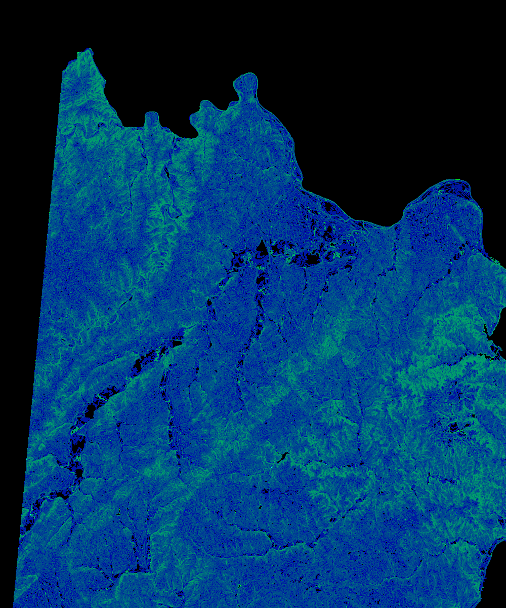
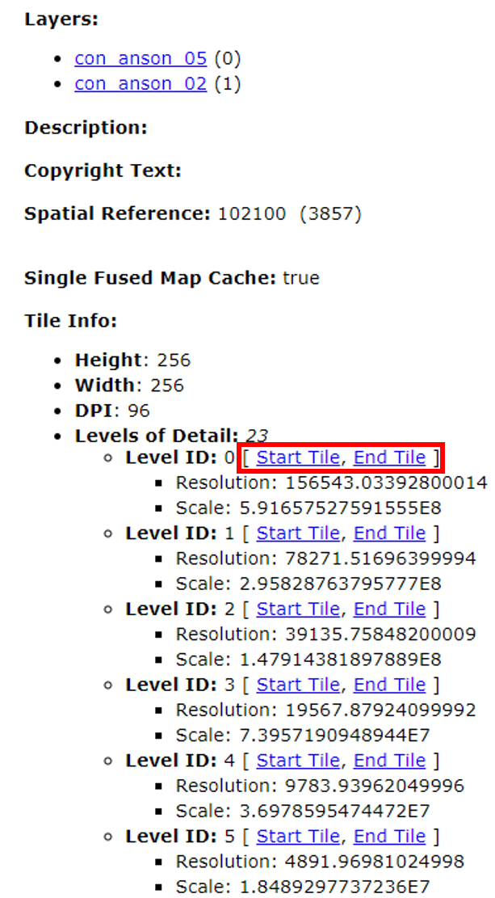

# Map-Cache-Verification
A tool to create a compound image of a Tile Cache Service to verify the integrity of cached images.  This script utilizes the Python Imaging Library to combine each tile image.

The verifyTileCache.py script iterates through the URL's of a Tile Cache Service and combines the images into a single large image to verify the integrity of each tile.  Also included is the visualizeTiles.py script which utilizes the Selenium Python library to iterate through tiles in a Tile Cache Service and quickly show the user the contents of each tile image for a given tile level.



## How it Works
The user needs to specify the start URL and the end URL, which are listed for a given tile level on the REST endpoint of the Tile Cache Service:


```python
xmin = int(start_url.split('/')[-1])
ymin = int(start_url.split('/')[-2])

xmax = int(end_url.split('/')[-1])
ymax = int(end_url.split('/')[-2])
```

Then we get the width and height of the entire image, with all tiles included:
```python
x_len = xmax - xmin
y_len = ymax - ymin
x_len, y_len
```

Using the width and height, we create the image with those dimensions:
```python
width = x_len * 100
height = y_len * 100
retimg = Image.new('RGB', (width, height))
```

Here, we iterate through the tile URL's with two nested for loops, the outer loop iterates through the x-values, while the inner loop iterates through the y-values for each x-value
```python
n = 0
imgs = {}
x_loc = 0
y_loc = 0
n_x = 0
n_y = 0
for x in range(xmin, xmax):
    for y in range(ymin, ymax):
        url = tile_url + str(y) +'/' + str(x)

        resp = requests.get(url, stream=True)
        resp.raw.decode_content = True

        img = Image.open(resp.raw)
        img.thumbnail((100,100))

        #bord_img = ImageOps.expand(img,border=5,fill=128)
        imgs[x,y] = img
        retimg.paste(img, (x_loc, y_loc))

        n_y += 1
        print('\r', 'image {} complete in column {}'.format(n_x, n_y), end='')
        #clear_output(wait=True)
        y_loc += 100

        #break
    print('\n', 'column {} complete, url = {}'.format(n_x, url))
    n_x += 1
    n_y = 0
    x_loc += 100
    y_loc = 0
    n += 1
```
